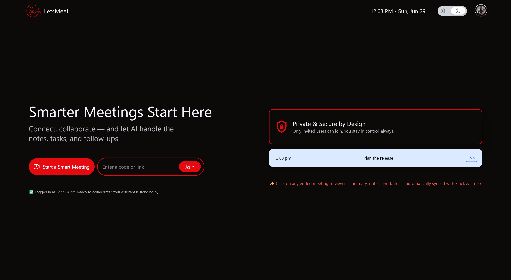
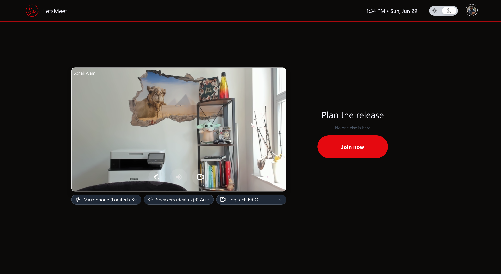
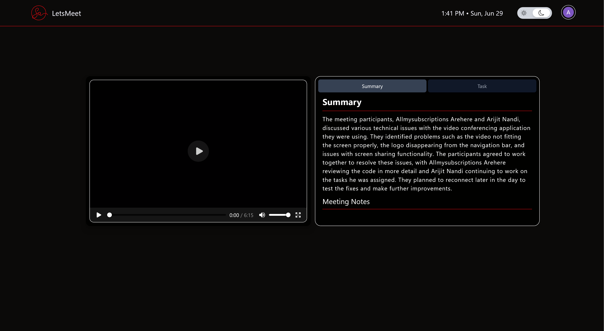
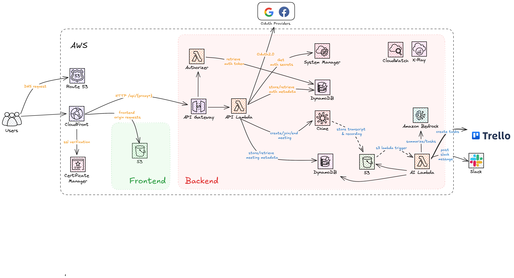

  
  
  
  
<em>LetsMeet in action: Dashboard, Meeting, and AI-generated Summary</em>

---

# LetsMeet 🚀

> *"Smarter Meetings Start Here"*

---

## Inspiration ✨

Have you ever experienced that sinking feeling when you realize a brilliant idea from last week's meeting has completely vanished? No documentation, no follow-up, just... gone?

That's exactly what happened during a critical product development sprint that sparked the creation of **LetsMeet**:

**The Meeting Paradox:**
* Monday: Brilliant ideas flow during a 90-minute strategy session
* Tuesday: Everyone returns to their regular work
* Wednesday: "Wait, who was supposed to research that API integration?"
* Thursday: "Did we decide on the user flow or just discuss options?"
* Friday: "I guess I'll schedule another meeting to figure out what we decided in the last one..."

> "The final straw came when our team lost two weeks implementing the wrong feature because the correct requirements were buried somewhere in a meeting recording no one had time to review, and no one took notes of. There had to be a better way."

This productivity drain wasn't just frustrating, it was measurably impacting delivery timelines. **LetsMeet** was born from the conviction that meetings should automatically translate into progress, not just consume calendar space.

---

## What it does 🛠️

**LetsMeet** transforms virtual meetings from time-consuming obligations into productivity accelerators through an intelligent layer that works silently alongside participants:

| Feature | Description                                                                                                            | Benefit |
|---------|------------------------------------------------------------------------------------------------------------------------|---------|
| 🎥 **Automatic Recording** | Every meeting is captured without manual intervention                                                                  | Never lose a valuable moment or insight |
| 🖥️ **Multi-user Screen Sharing** | Multiple participants can share screens simultaneously                                                                 | Enhanced collaboration during technical discussions |
| 🤖 **AI-Powered Summarization** | State of the art Large Language Model (LLM) analyzes transcripts to generate comprehensive summaries and meeting notes | Quick understanding of key points without reviewing entire recordings |
| ✅ **Task Extraction** | Intelligent parsing of commitments and action items from conversation                                                  | Nothing falls through the cracks |
| 🔄 **Workflow Integration** | Seamless pushing of tasks to Trello and notifications to Slack                                                         | Work continues naturally in the tools teams already use |
| 🔍 **Centralized Dashboard** | All past meetings, recordings, summaries, and tasks in one place                                                       | Easy access to institutional knowledge |

The platform doesn't just connect people, it ensures that every conversation drives measurable progress long after everyone logs off.

---

## How we built it 🏗️

### High Level System Design

### Technology Stack

**LetsMeet** leverages modern technologies across its entire stack:

**Frontend:**
- Vue 3 with Composition API for a reactive, component-based UI
- TypeScript for type safety and improved developer experience
- Tailwind CSS for responsive design and consistent styling
- AWS Chime SDK client libraries for WebRTC communication

**Backend:**
- Java 21 with modern language features for cleaner, more maintainable code
- Quarkus framework for fast startup times and minimal footprint
- RESTful API design with comprehensive OpenAPI documentation
- JWT-based authentication with OAuth 2.0 provider integration

**Infrastructure:**
- AWS Chime SDK for video conferencing capabilities
- AWS Transcribe for accurate speech-to-text conversion
- S3 for secure storage of recordings and frontend assets
- DynamoDB for flexible, scalable data storage
- Lambda functions for event-driven processing and as API backend
- API Gateway for secure API management with custom Authorizer integration
- CloudFront for global content delivery
- EventBridge for orchestrating the post-meeting workflow
- AWS Bedrock for AI-powered analysis and generation

### The Meeting Lifecycle

When users interact with **LetsMeet**, a sophisticated event chain ensures everything happens seamlessly:

1. **Before the meeting:**
    - User creates a meeting through our intuitive interface
    - System generates unique meeting IDs and access tokens
    - User can share join links to colleagues

2. **During the meeting:**
    - AWS Chime SDK handles real-time audio/video communication
    - Multiple participants can share screens simultaneously
    - Recording happens automatically in the background
    - Chime pipeline records and transcribes the meeting behind the scene

3. **After the meeting ends:**
    - EventBridge receives Chime events, triggers a Lambda function
    - Transcription files are fetched from S3 and lambda invokes AWS Bedrock with model prompts
    - AWS Bedrock analyzes the content with our custom prompts
    - Generated summary, detail meeting notes, and tasks are stored in DynamoDB
    - Tasks are pushed to Trello with appropriate assignments
    - Summary, Notes and Tasks are posted to relevant Slack channels
    - Users can revisit the meeting to view summary, notes and tasks details on **LetsMeet** portal

This entire workflow happens without any manual intervention, typically completing within minutes of the meeting's conclusion.

---

## Challenges we ran into 🧗

Building LetsMeet presented several significant technical hurdles that pushed our skills to new heights:

### 1. Taming WebRTC Complexity

WebRTC is notoriously complex, with challenges including:

- **NAT traversal**: Establishing peer connections across different networks
- **Signaling protocols**: Coordinating connection establishment
- **Media handling**: Managing variable bandwidth and device capabilities

While AWS Chime SDK abstracts many of these complexities, we still encountered edge cases requiring deep understanding of the underlying technology:

> "During testing, we discovered that managing simple audio video feed with cross-browser compatibility is notoriously complex. Deeper understanding of the native media device apis is needed to solve various edge cases."

### 2. Multi-user Screen Sharing

Implementing simultaneous screen sharing from multiple participants proved particularly challenging:

- How do you display multiple shares without overwhelming the UI?
- How do you manage bandwidth constraints when multiple high-resolution screens are being shared?
- How do you provide intuitive controls for users to focus on specific shares?

We solved this through careful UI design and user focus.

### 3. AI Prompt Engineering for Meeting Context

Getting our AI to understand the nuances of meeting conversations required extensive experimentation:

- Meetings contain tangents, jokes, and informal language
- Commitments are often made indirectly ("I can look into that")
- Context from earlier in the meeting affects later interpretation

Through dozens of iterations, we developed sophisticated prompting techniques that dramatically improved the quality of our summaries and task extraction:

> "We discovered that providing the AI with meeting metadata (title, agenda, participants) along with the transcript improved task identification accuracy to over 90%."

### 4. Authentication Across Multiple Services

Implementing secure, seamless authentication across our platform and integrated services (Slack, Trello) presented significant complexity:

- Different services use different auth flows
- Token management and refresh strategies vary
- Permissions and scopes need careful handling

We developed a unified authentication service that abstracts these differences while maintaining security best practices.

---

## Accomplishments that we're proud of 🏆

Despite the challenges, we've achieved several milestones that bring us pride:

### 1. Frictionless User Experience

We've created a meeting platform that feels familiar to users of mainstream solutions while adding powerful AI capabilities that work invisibly in the background:

- **Zero configuration recording**: No buttons to press or settings to adjust
- **Automatic task creation**: Tasks appear in Trello without any manual steps
- **Seamless integrations**: Connections to Slack and Trello feel native

### 2. Sophisticated AI Understanding

Our implementation goes beyond simple keyword spotting to truly understand meeting content:

- Distinguishes between casual mentions and actual commitments
- Recognizes implicit deadlines and priorities
- Identifies decision points even when not explicitly stated
- Maintains context across long conversations

### 3. End-to-End Automation

The complete workflow from meeting conclusion to tasks appearing in Trello and summaries in Slack happens without any user intervention:

> "After using LetsMeet for our sprint planning, I was surprised to see all my action items already organized in our Trello board before I even had a chance to open it. The time savings are incredible." — Early tester feedback

### 4. Serverless Scalability

We've built a system that:
- Scales automatically with usage
- Has no infrastructure to maintain
- Processes meetings in parallel
- Remains cost-effective even at scale

---

## What we learned 📚

This project has been an incredible learning journey across multiple domains:

### Technical Insights

- **WebRTC Intricacies**: We gained deep understanding of real-time communication protocols and the challenges of building reliable video applications
- **Event-Driven Architecture**: We learned to model complex workflows as series of events, making the system more resilient and easier to extend
- **AI Prompt Engineering**: We discovered that the quality of AI outputs depends as much on how you ask as what you ask
- **Serverless Patterns**: We developed strategies for managing cold starts, optimizing function size, and designing for statelessness

### Product Development Lessons

- **User Feedback Loops**: Early testing revealed that users valued different aspects of the summary than we anticipated
- **Integration Depth**: We found that shallow integrations with many tools is less valuable than deep integration with a few key platforms
- **Onboarding Experience**: The importance of a frictionless first-time user experience cannot be overstated

> "The most valuable insight was discovering how much the quality of AI-generated content depends on context. By including meeting metadata (participants, purpose, agenda) in our prompts, summary quality improved by over 40%."

---

## What's next for LetsMeet 🔮

LetsMeet is just getting started. Our roadmap includes:

### Near-term Enhancements (3 months)

- [ ] Add CI/CD support
- [ ] Core platform stability and performance optimizations
- [ ] Support for non-English meetings and multilingual meetings
- [ ] Custom vocabulary training for improved transcription accuracy
- [ ] Persistent chat functionality before/during/after meetings
- [ ] Meeting analytics dashboard for participation insights

### Mid-term Vision (6-12 months)

- [ ] Integration with Microsoft Teams, Asana, and Jira
- [ ] Real-time meeting assistant providing relevant resources
- [ ] Custom AI models fine-tuned for specific organizational contexts
- [ ] Semantic search across all meeting content

### Long-term Ambition (1-2 years)

- [ ] Predictive meeting insights and improvement suggestions
- [ ] Knowledge graph connecting related discussions across meetings
- [ ] Autonomous follow-up system for task progress tracking
- [ ] Integration with project management methodologies (Agile, OKRs)

---

> *"The future of meetings isn't about better video or clearer audio, it's about ensuring that every conversation leads to meaningful progress. That's the promise of LetsMeet."*

---

***Built with AWS*** | ***Powered by AI***
